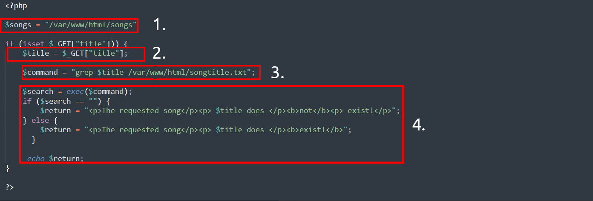
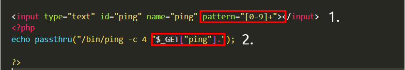
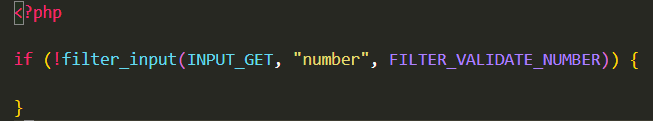
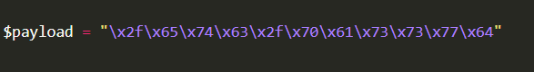

# Command Injection

[Retour](../../README.md)

## Definition

L'injection de commandes est un abus du comportement d'une application pour exécuter des commandes sur le système
d'exploitation, en utilisant les mêmes privilèges que ceux avec lesquels l'application sur un appareil s'exécute.
Par exemple, réaliser l'injection de commandes sur un serveur Web exécuté en tant qu'utilisateur nommé joe exécutera
les commandes sous cet utilisateur et obtiendra donc toutes les autorisations dont il dispose.

L’injection de commandes est également souvent appelée « exécution de code à distance » (RCE) en raison de la
possibilité d’exécuter du code à distance au sein d’une application. Ces vulnérabilités sont souvent les plus lucratives
pour un attaquant, car elles signifient que celui-ci peut interagir directement avec le système vulnérable.
Par exemple, un attaquant peut lire des fichiers système ou utilisateur, des données et des éléments de cette nature.

Par exemple, être capable d'abuser d'une application pour exécuter la commande `whoami` permettant de d'identifier
le compte utilisateur utilisé par l'application sera un exemple d'injection de commande.

## Découverte

Cette vulnérabilité existe parce que les applications utilisent souvent des fonctions dans des langages de programmation
tels que PHP, Python et NodeJS pour transmettre des données et effectuer des appels système sur le système
d'exploitation de la machine. Par exemple, prendre une entrée dans un champ et rechercher une entrée dans un fichier.
Prenons cet extrait de code ci-dessous comme exemple :

Dans cet extrait de code, l'application prend les données qu'un utilisateur saisit dans un champ de saisie nommé $title 
pour rechercher dans un répertoire le titre d'une chanson. Décomposons cela en quelques étapes simples.

1. L'application stocke les fichiers MP3 dans un répertoire contenu sur le système d'exploitation.

2. L'utilisateur saisit le titre de la chanson qu'il souhaite rechercher. L'application stocke cette entrée dans la variable $title.

3. Cette variable $title est transmise à la commande `grep` pour rechercher un fichier texte nommé songtitle.txt
   dans le dossier.

4. L'utilisateur reçoit alors un message si le fichier existe ou non.

Un attaquant pourrait abuser de cette application en injectant ses propres commandes afin de lire le contenu
de fichiers plus sensible.

Il est possible d'abuser des applications de cette manière, quel que soit le langage de programmation utilisé par
l'application. Tant que l’application sert directement d'un input utilisateur afin de construire une comande système, cela peut entraîner une injection de commandes. 
Par exemple, cet extrait de code ci-dessous est une application écrite en Python.

1. Le package "flask" permet de mettre en place un serveur web
2. Une fonction qui utilise le package "subprocess" pour exécuter une commande sur le périphérique
3. Nous utilisons une route sur le serveur Web qui exécutera tout ce qui est fourni. Par exemple, pour exécuter `whoami`, nous devrons visiter http://flaskapp.thm/whoami

## Exploitation

Les applications qui utilisent les inputs de l'utilisateur pour remplir les commandes système avec des données peuvent 
souvent être combinées dans un comportement involontaire. Par exemple, les opérateurs shell `;`,`,`,`&` et `&&` combineront deux (ou plus)
commandes système et les exécuteront toutes les deux.

L’injection de commande peut être détectée principalement de deux manières :

### Détection de l'injection de commande aveugle

L'injection de commande aveugle consiste en une injection de commande classique cependant, aucune sortie n’est
visible, elle n’est donc pas immédiatement perceptible. Par exemple, une commande est exécutée, mais l'application Web ne génère aucun message.

Pour ce type d’injection de commandes, nous devrons utiliser des charges utiles qui entraîneront un certain retard.
Par exemple, les commandes ping et sleep sont des charges utiles importantes avec lesquelles tester. 
À titre d'exemple ping, l'application se bloquera pendant x secondes par rapport au nombre de pings que vous avez spécifié.

Une autre méthode de détection de l’injection aveugle de commandes consiste à forcer certaines sorties. 
Cela peut être fait en utilisant des opérateurs de redirection tels que `>`.
Par exemple, nous pouvons demander à l'application Web d'exécuter des commandes telles que `whoami` et de les rediriger vers un fichier. Nous pouvons ensuite 
utiliser la commande `cat` afin lire le contenu de ce fichier nouvellement créé.

### Détection d'une injection de commande verbeuse

Détecter l’injection de commandes de cette manière est sans doute la méthode la plus simple des deux. 
L'injection de commandes verbeuses se produit lorsque l'application vous donne des commentaires ou des informations 
sur ce qui se passe ou est en cours d'exécution.

Par exemple, la sortie de commandes telles que `ping` ou `whoami` est directement affichée sur l'application Web.

## Correction

L’injection de commandes peut être évitée de différentes manières:

- Minimaliser l'utilisation de fonctions ou de bibliothèques potentiellement dangereuses dans un langage de programmation
- Filtrer les entrées utilisateur
- Utiliser des fonctions de bibliothèque qui effectuent des appels système de manière sécurisée

### Fonctions vulnérables

En PHP, de nombreuses fonctions interagissent avec le système d'exploitation pour exécuter des commandes via le shell.

- [exec](https://www.php.net/manual/en/function.exec.php)
- [passthru](https://www.php.net/manual/en/function.passthru.php)
- [system](https://www.php.net/manual/en/function.system.php)

Prenons cet extrait ci-dessous comme exemple:

1. L'application n'acceptera qu'un modèle de caractères spécifique (les chiffres 0-9)
2. L'application procédera alors uniquement à l'exécution de ces données qui sont toutes numériques.

Ces fonctions acceptent des entrées telles qu'une chaîne ou des données utilisateur et exécuteront tout ce qui est 
fourni sur le système. Toute application qui utilise ces fonctions sans vérifications appropriées sera vulnérable à l’injection de commandes.

### Input sanitisation

Nettoyer toute entrée d’un utilisateur utilisée par une application est un excellent moyen d’empêcher l’injection de commandes.
Il s'agit d'un processus de spécification des formats ou des types de données qu'un utilisateur peut soumettre. 
Par exemple, un champ de saisie qui accepte uniquement les données numériques ou supprime les caractères spéciaux tels que > , &et /.

Dans l'extrait ci-dessous, la filter_input fonction PHP est utilisée pour vérifier si les données soumises via un formulaire
de saisie sont ou non un nombre. S'il ne s'agit pas d'un nombre, il doit s'agir d'une saisie invalide.

## CheatSheet

https://github.com/payloadbox/command-injection-payload-list