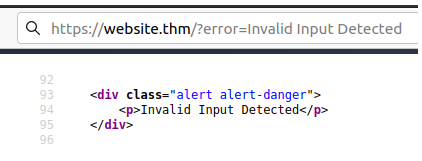
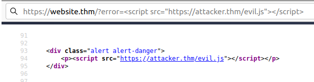
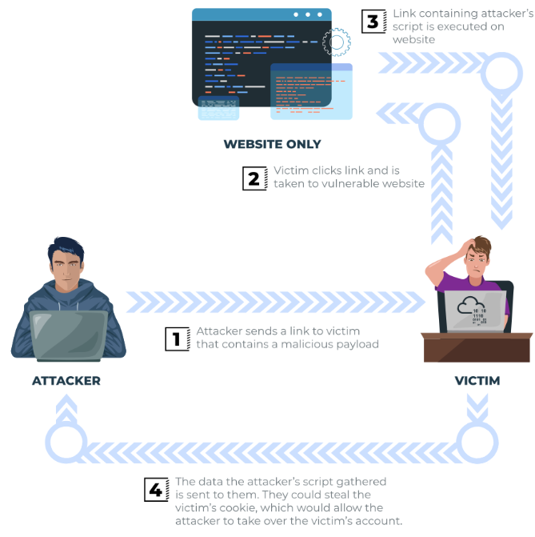

[Retour](intro.md)
# Reflected XSS

Le XSS réfléchi se produit lorsque les données fournies par l'utilisateur dans une requête HTTP
sont incluses dans la source de la page Web sans aucune validation.

**Exemple de scénario :**

un site Web sur lequel si vous saisissez une saisie incorrecte, un message d'erreur s'affiche.
Le contenu du message d'erreur est extrait du paramètre d'erreur dans la chaîne de requête et est intégré directement dans la source de la page.

L'application ne vérifie pas le contenu du paramètre error, ce qui permet à l'attaquant d'insérer du code malveillant.

La vulnérabilité peut être utilisée selon le scénario de l'image ci-dessous :

**Impact potentiel :**

l'attaquant pourrait envoyer des liens ou les intégrer dans une iframe sur un autre site Web contenant une payload
JavaScript aux victimes potentielles, les incitant à exécuter du code sur leur navigateur, révélant potentiellement des informations sur la session ou le client.

**Comment tester Reflected XSS :**

Vous devrez tester tous les points d'entrée possibles ; ceux-ci inclus:

- Paramètres dans la chaîne de requête URL
- Chemin du fichier URL
- Parfois des en-têtes HTTP (bien que peu exploitables en pratique)
